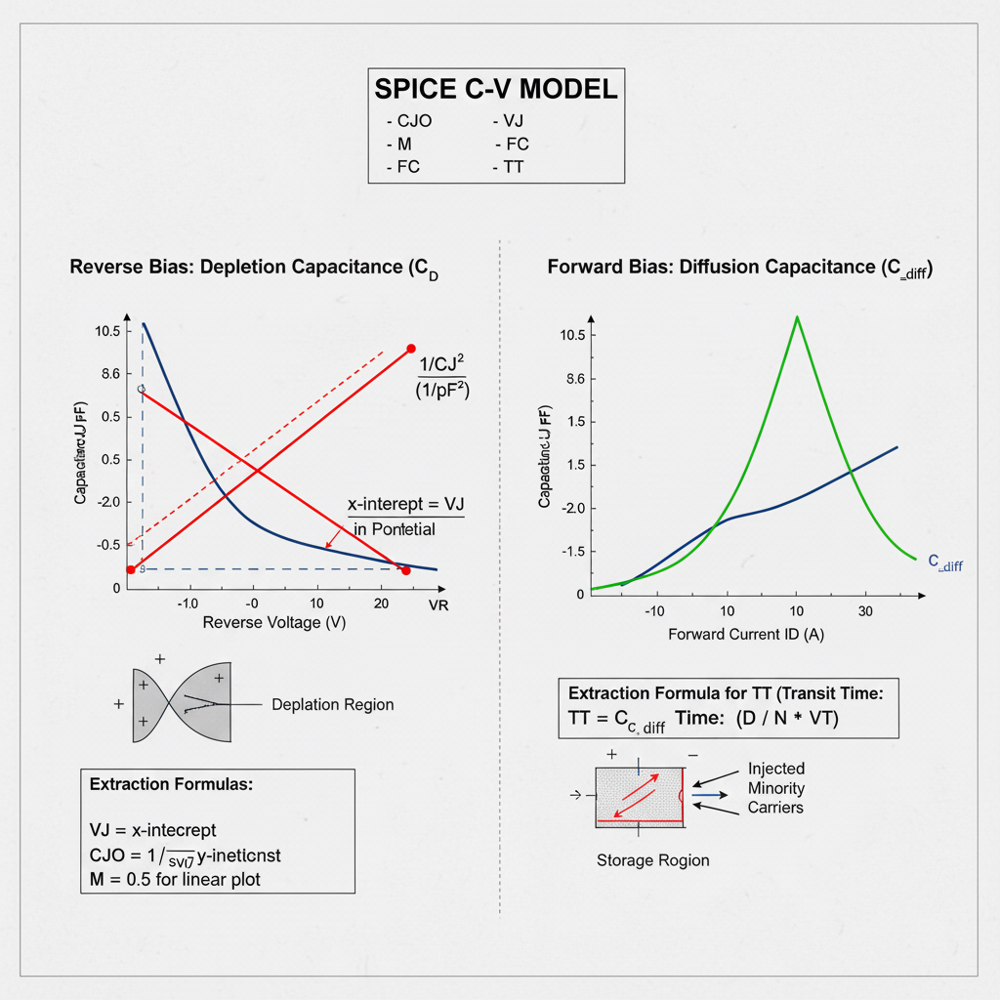

## Theory
**Introduction:**  
Extraction of Diode SPICE C-V Parameters

      
      
<strong>Fig. 1. Threshold Voltage and Inversion charge</strong>

The capacitance of a p-n junction is not constant; it varies with the applied voltage. The total capacitance ($C_J$) modeled in SPICE is the sum of two distinct physical components:

1.  **Depletion Capacitance ($C_D$ or $C_j$):** Dominant under reverse bias.
2.  **Diffusion Capacitance ($C_{diff}$):** Dominant under forward bias.

$$C_J = C_D + C_{diff}$$

The extraction process involves separating these two components and finding the SPICE parameters that govern their behavior.

---

## 1. Depletion Capacitance ($C_D$)

This capacitance arises from the charge stored in the depletion region (or space-charge region) at the p-n junction. As the reverse voltage increases, the depletion region widens, changing the amount of stored charge.

### Key SPICE Parameters

* **`CJO` (Zero-Bias Junction Capacitance):** The value of the depletion capacitance when the applied voltage $V_D$ is zero.
* **`VJ` (Junction Potential):** Also known as `PB`, this is the built-in potential (e.g., ~0.6-0.8V for silicon) of the junction.
* **`M` (Grading Coefficient):** Describes the doping profile of the junction.
    * `M = 0.5` for an abrupt (step) junction.
    * `M = 0.33` for a linearly graded junction.
* **`FC` (Forward-Bias Capacitance Coefficient):** A fitting parameter (default 0.5) used to linearize the capacitance equation under forward bias to prevent the model from becoming singular at $V_D = VJ$.

### The Model Equation

The standard SPICE equation for depletion capacitance under reverse bias ($V_D < FC \cdot VJ$) is:

$$C_D = \frac{CJO}{(1 - V_D / VJ)^M}$$

*(Note: For reverse bias, $V_D$ is negative, so the denominator increases as reverse bias increases, and capacitance decreases.)*

### Extraction Method: The $1/C^2$ Plot

The parameters `CJO`, `VJ`, and `M` are extracted from C-V measurements taken under **reverse bias**, where $C_J \approx C_D$.

The extraction method linearizes the model equation. For the most common case of an **abrupt junction (M = 0.5)**, we can square and invert the equation:

$$C_D^2 = \frac{CJO^2}{(1 - V_D / VJ)}$$

$$\frac{1}{C_D^2} = \frac{1 - V_D / VJ}{CJO^2} = \left( \frac{1}{CJO^2} \right) - \left( \frac{1}{CJO^2 \cdot VJ} \right) \cdot V_D$$

This equation is in the linear form $y = b + m \cdot x$, where:
* $y = 1/C_D^2$
* $x = V_D$ (the applied voltage)
* $b = 1/CJO^2$ (the y-intercept)
* $m = -1 / (CJO^2 \cdot VJ)$ (the slope)

**Extraction Procedure:**

1.  **Measure C-V:** Measure the diode's capacitance $C_J$ at several reverse bias voltages $V_D$ (e.g., from 0V to -10V).
2.  **Plot Data:** Create a plot of $1/C_J^2$ (y-axis) versus $V_D$ (x-axis). The data should form a straight line.
3.  **Extract `VJ`:** Extend the straight line to the x-axis (where $y=0$). The x-intercept is the junction potential, **`VJ`**.
4.  **Extract `CJO`:** The y-intercept (at $V_D = 0$) is $1/CJO^2$. Therefore, **`CJO`** is calculated as:
    $$CJO = \frac{1}{\sqrt{\text{y-intercept}}}$$
5.  **Verify `M`:** If the plot is indeed a straight line, the assumption that `M = 0.5` is correct. If the plot is curved, a different value of `M` may be needed (e.g., plot $1/C_J^3$ for `M=0.33`).

---

## 2. Diffusion Capacitance ($C_{diff}$)

This capacitance arises from the charge of minority carriers injected into the quasi-neutral regions during **forward bias**. It is directly related to the forward current $I_D$ and the time it takes for these carriers to recombine.

### Key SPICE Parameter

* **`TT` (Transit Time):** Represents the mean time for injected minority carriers to transit through the neutral region (or recombine).

### The Model Equation

The diffusion capacitance is defined as the change in stored minority charge ($Q_{diff}$) with respect to the junction voltage ($V_j$):

$$C_{diff} = \frac{dQ_{diff}}{dV_j}$$

The stored charge is $Q_{diff} = I_D \cdot TT$. The dynamic conductance of the diode is $g_d = dI_D/dV_j$. This leads to the model equation:

$$C_{diff} = TT \cdot \frac{dI_D}{dV_j} \approx TT \cdot \frac{I_D}{N \cdot V_T}$$

Where $N$ is the ideality factor and $V_T$ is the thermal voltage (both extracted from I-V measurements).

### Extraction Method

The transit time `TT` must be extracted from measurements taken under **forward bias**, where $C_J = C_D + C_{diff}$.

**Extraction Procedure:**

1.  **Measure C-V in Forward Bias:** Measure the total capacitance $C_J$ at a specific forward current $I_D$ (and its corresponding voltage $V_D$).
2.  **Calculate $C_D$:** At this $V_D$, the depletion capacitance $C_D$ is still present. It is calculated using the forward-bias part of its model (which uses the `FC` parameter).
3.  **Isolate $C_{diff}$:** Subtract the calculated depletion capacitance from the total measured capacitance:
    $$C_{diff} = C_{J, \text{measured}} - C_{D, \text{calculated}}$$
4.  **Extract `TT`:** Re-arrange the model equation to solve for `TT`. You will need the values of $I_D$, $N$, and $V_T$ (from I-V analysis) at the bias point.
    $$TT = \frac{C_{diff}}{g_d} = \frac{C_{diff}}{(I_D / (N \cdot V_T))}$$

This gives the value for `TT`, completing the C-V parameter extraction.

     
 
